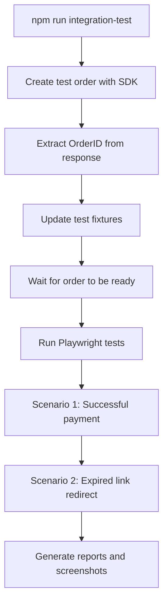

# Felix Pago Playwright Framework

A comprehensive end-to-end testing framework for Felix Pago payment system that integrates Playwright UI testing with Overseer service order creation using TypeScript SDK.

## 🚀 Quick Start

Run the complete integration test workflow with a single command:

```bash
npm run integration-test
```

This command will:
1. ✅ Create a test order using the TypeScript SDK
2. ✅ Update test fixtures with the new order ID  
3. ✅ Run Playwright tests in Chrome
4. ✅ All automatically, no manual steps required

## 📋 Prerequisites

Before running the framework, ensure you have:

- **Node.js** (v16 or higher)
- **npm** or **yarn**
- **Google Cloud Platform** access
- **Overseer TypeScript SDK** installed

## 🛠️ Setup Instructions

### 1. Install Dependencies

```bash
# Install project dependencies
npm install

# Install Playwright browsers
npm run install-browsers
```

### 2. Install Overseer TypeScript SDK

```bash
# Install the Overseer TypeScript SDK
npm install ../overseer/overseer/ts-sdk
```

### 3. Configure Google Cloud Credentials

The framework uses Google Cloud Platform service account for authentication. Ensure you have:

- **Service Account Key**: `overseer-sandbox.json` in the project root
- **Project ID**: `felix-technologies`
- **Service Account**: `overseer-run-sandbox@felix-technologies.iam.gserviceaccount.com`

The credentials file should be placed at:
```
/playwright-framework-test/overseer-sandbox.json
```

### 4. Verify Configuration

```bash
# Test order creation (optional verification)
npm run create-order
```

## 🎯 Main Integration Script

### `npm run integration-test`

This is the **main command** that executes the complete end-to-end testing workflow.

#### What it does:

1. **Creates Order**: Uses TypeScript SDK to generate a fresh orderID via `saveOrder()` and `startProcess()`
2. **Updates Test Fixtures**: Automatically updates `src/fixtures/test-data.ts` with the new orderID
3. **Runs Playwright Tests**: Executes `combined-payment-scenarios.spec.ts` in Chromium
4. **Fully Automated**: No manual intervention required

#### Execution Flow:



#### Configuration Options:

- **Order Ready Delay**: Set `ORDER_READY_DELAY` environment variable (default: 5000ms)
- **Browser**: Runs in Chrome (Chromium) only
- **Workers**: Sequential execution (`--workers=1`)
- **Timeout**: 45 seconds for success page validation

## 📊 Available NPM Scripts

### Main Commands

| Script | Description | Usage |
|--------|-------------|-------|
| `integration-test` | **Complete workflow** (create order + update fixtures + run test) | `npm run integration-test` |
| `integration-test:setup` | Order setup only (create order + update fixtures) | `npm run integration-test:setup` |
| `test:combined-chrome` | Run Playwright test only (requires order already set up) | `npm run test:combined-chrome` |

### Utility Commands

| Script | Description | Usage |
|--------|-------------|-------|
| `create-order` | Create test order only | `npm run create-order` |
| `test` | Run all Playwright tests | `npm test` |
| `test:headed` | Run tests with browser visible | `npm run test:headed` |
| `test:debug` | Run tests in debug mode | `npm run test:debug` |
| `test:ui` | Run tests with UI mode | `npm run test:ui` |
| `report` | Show HTML test report | `npm run report` |

## 🧪 Test Scenarios

### Scenario 1: Successful Payment Flow
- Navigate to payment review page
- Validate payment amounts
- Complete payment process (CVV entry)
- Verify success page with correct URL and messages
- Validate "Back to WhatsApp" button

### Scenario 2: Expired Link Redirect
- Navigate to the same payment review URL
- Validate redirect to homepage
- Verify correct URL pattern and page elements
- Confirm calculator form and main buttons are visible

## 🏗️ Project Architecture

### Page Object Model (POM)

```
src/pages/
├── base-page.ts              # Base page with common functionality
├── payment-review-page.ts    # Payment review page interactions
├── payment-status-page.ts    # Success page validations
└── homepage.ts              # Homepage interactions
```

### Test Data Management

```
src/fixtures/
├── test-fixtures.ts          # Playwright fixtures extension
└── test-data.ts             # Centralized test data and interfaces
```

### Integration Layer

```
lib/overseer-client/
├── simple-client.ts         # Overseer gRPC client
├── auth.ts                 # GCP authentication with JWT
├── config.ts              # Configuration management
├── types.ts               # TypeScript interfaces
└── order-generator.ts     # Order document generation
```

## 🔧 Configuration

### Playwright Configuration

- **Base URL**: `https://test.pay.felixpago.com`
- **Browsers**: Chromium, Firefox, WebKit
- **Mode**: Parallel in CI, sequential locally
- **Reports**: HTML and JSON output
- **Screenshots**: Only on failure
- **Videos**: Retained on failure

### Overseer Configuration

- **Project ID**: `felix-technologies`
- **Service Name**: `nightveil`
- **HTTP Endpoint**: `https://overseer-sandbox-tl5k5elgjq-uc.a.run.app`
- **gRPC Endpoint**: `overseer-sandbox-tl5k5elgjq-uc.a.run.app:443`

## 📸 Test Output

### Screenshots
- `screenshots/` directory
- Timestamped filenames
- Captured on test failures and key steps

### Videos
- `videos/` directory
- Recorded on test failures
- Full page recordings

### Reports
- `playwright-report/` directory
- HTML report with detailed results
- `test-results/results.json` for programmatic access

## 🐛 Troubleshooting

### Common Issues

#### 1. SDK Not Found
```bash
# Solution: Install the Overseer TypeScript SDK
npm install ../overseer/overseer/ts-sdk
```

#### 2. GCP Credentials Error
```bash
# Solution: Verify service account key file exists
ls -la overseer-sandbox.json

# Check environment variable
echo $GOOGLE_APPLICATION_CREDENTIALS
```

#### 3. Order ID Extraction Failed
- Check network connectivity to Overseer service
- Verify GCP authentication is working
- Review order creation logs for errors

#### 4. Playwright Tests Failing
- Ensure test data is properly updated with valid OrderID
- Check if payment URLs are accessible
- Verify browser installation: `npm run install-browsers`

### Debug Mode

```bash
# Run tests in debug mode
npm run test:debug

# Run with UI mode for interactive debugging
npm run test:ui
```

### Manual Verification

```bash
# Test order creation only
npm run create-order

# Test Playwright only (with existing order)
npm run test:combined-chrome
```

## 📝 Development

### Adding New Test Scenarios

1. Create new page object in `src/pages/`
2. Add test data interfaces in `src/fixtures/test-data.ts`
3. Create test file in `tests/`
4. Update fixtures if needed

### Modifying Order Data

Edit `scripts/create-test-order.ts` to change:
- Phone numbers
- Amounts
- Beneficiary information
- Delivery methods

### Environment Variables

- `ORDER_READY_DELAY`: Delay before running tests (default: 5000ms)
- `GOOGLE_APPLICATION_CREDENTIALS`: Path to service account key

## 🔍 Monitoring and Logging

The integration script provides detailed logging with:
- **Timestamps**: ISO format timestamps
- **Color coding**: Success (green), errors (red), warnings (yellow)
- **Progress indicators**: Step-by-step execution status
- **Error details**: Comprehensive error messages and stack traces

## 📚 Additional Resources

- [Playwright Documentation](https://playwright.dev/)
- [TypeScript SDK Documentation](../overseer/overseer/ts-sdk/README.md)
- [Google Cloud Authentication](https://cloud.google.com/docs/authentication)

## 🤝 Contributing

1. Follow the existing Page Object Model pattern
2. Add proper TypeScript types for new interfaces
3. Include error handling and retry logic
4. Update documentation for new features
5. Test changes with `npm run integration-test`

## 📄 License

MIT License - see LICENSE file for details.

---

**Need help?** Check the troubleshooting section or run `npm run test:debug` for interactive debugging.
